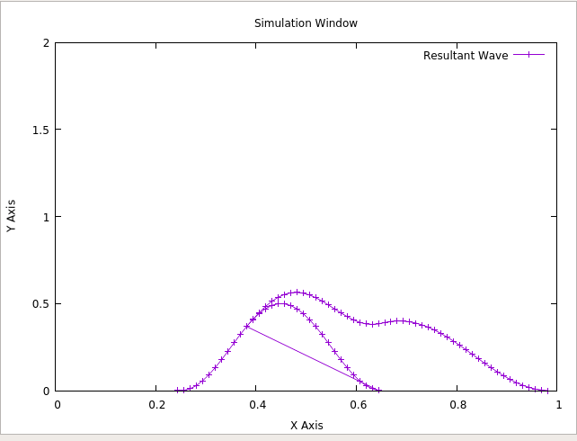

# Simple 2D Wave Simulation
The program simulates two waves given a simple boundary condition at the extremeties of the x-axis.
The code is inspired by the work of Mr. Doyub Kim as part of the book ["Fluid Engine Development"](https://www.crcpress.com/Fluid-Engine-Development/Kim/p/book/9781498719926). 

